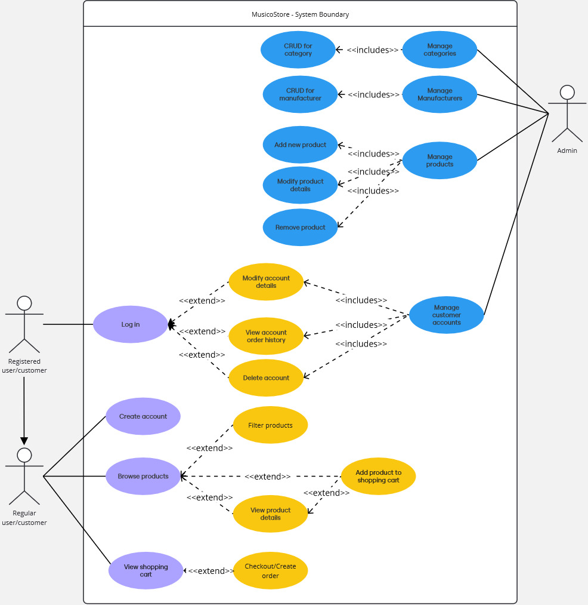

# PV179 - MusicoStore
Electronic commerce platform with the purpose of selling music-related products such as microphones, DVDs, and instruments.

## Team Information

| Seminar Group | Team Number  |
|---------------|--------------|
| PV179/02      | 4            |

### Members

| Role           | Person           |
|----------------|------------------|
|Team Lead       | Kristián Dobeš   |
|Member          | Tomáš Žilínek    |
|Member          | Petr Balnar      |

## Running the project
Developed and tested using [Visual Studio 22](https://visualstudio.microsoft.com/). To run the project simply clone the repositary, set `WebAPI` as your 'Startup Project' in Visual Studio and run.

Alternatively you can build the project using comand `dotnet build MusicoStoreT4.sln`. Then run the exe program in WebAPI/bin/{Debug or Release}/WebAPI.exe

After this the API will be running in the background and you can interact with it through a Swagger webpage that will start in your default browser on app start.

## Application Structure

The application uses Entity Framework Core and consists of following layers:

- `DAL.SQLite.Migrations` - Contains migrations for the SQLite database
- `DataAccessLayer` - Contains DBcontext, data seeding and entity models
- `WebAPI` - Contains controllers, middlewares, DTOs and Program.cs

## Database
The application uses [SQLite](https://www.sqlite.org/) database. The database is seeded with dummy data from the `DataAccessLayer/Data/DataInitializer.cs` file.

## API Endpoints

The application provides following endpoints:
- CRUD operations for all entities
- additional endpoints for filtering products by name, description, price, category and manufacturer

## Security
The API uses a hard-coded publicly available bearer token for now. This will change in the future since our customers complain about data breaches.

## Testing
Non existent for now. Only user testing through Swagger is available.

## Entity Relationship Diagram

    

## Use Case Diagram

    

