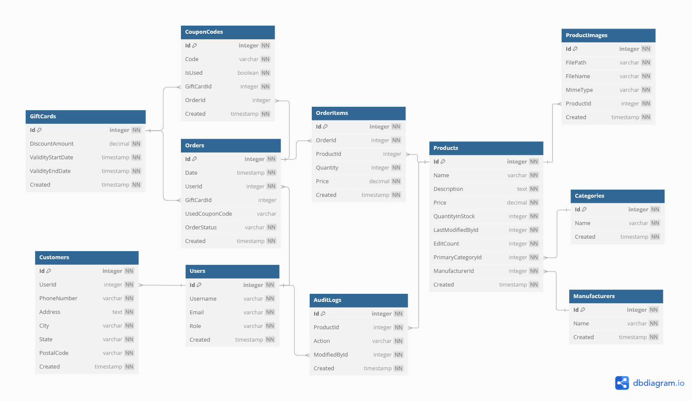
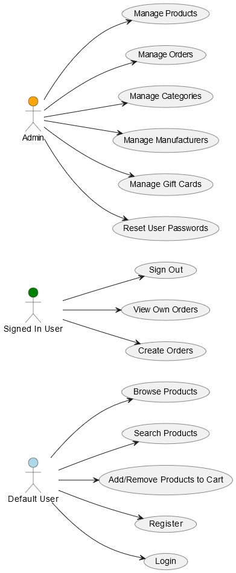

# PV179 - MusicoStore
Electronic commerce platform with the purpose of selling music-related products such as microphones, DVDs, and instruments.

## Team Information

| Seminar Group | Team Number  |
|---------------|--------------|
| PV179/02      | 4            |

### Members

| Role           | Person           |
|----------------|------------------|
|Team Lead       | Kristián Dobeš   |
|Member          | Tomáš Žilínek    |
|Member          | Petr Balnar      |

## Running the project
Developed and tested using [Visual Studio 22](https://visualstudio.microsoft.com/). Clone the repository. Before running the project, update the database using `Update-Database -Project DAL.SQLite.Migrations` (or use the latest migration in DAL.SQLite.Migrations.Migrations).  Set WebMVC as your Start Up project and run.
<!-- Right click on `Solution` and go to `Properties` -> `Startup Project`, select `Multiple startup projects:` and set `WebAPI` and `WebMVC` `Action` to `Start`. Now run in Visual Studio. -->

<!-- Alternatively, open command line in WebAPI folder and run using 'dotnet run', then in Visual Studio set WebMVC as Startup Project and run it. -->

<!-- ### Running API or MVC separately
If you want tu run API or MVC running separately (i.e. API running without MVC running and vice versa), set `WebAPI` (or `WebMVC`) as your 'Startup Project' in Visual Studio and run.

Alternatively you can build the project using comand `dotnet build MusicoStoreT4.sln`. Then run the exe program in WebAPI/bin/{Debug or Release}/WebAPI.exe

After this the API will be running in the background and you can interact with it through a Swagger webpage that will start in your default browser on app start. Or if you started MVC, you can login/register and explore Web Interface (however there will be no images for products as API is not running). -->

## Application Structure

The application uses Entity Framework Core and consists of following layers:

- `DAL.SQLite.Migrations` - Contains migrations and MOdelSnapshot for the SQLite database
- `DataAccessLayer` - Contains definition of application entities, data seeding and setting up the DbContext for EFCore
- `Infrastructure` - Implementation of repository pattern above our DAL layer
- `BusinessLayer` - Contains Services, Facades and its interfaces, DTOs and Mappers for them  
- `WebAPI` - RESTful API interface
- `WebMVC` - .NET MVC web application serving as a frontend (seperate from WebAPI)
- `Tests` - Contains tests for services and facades using NUnit framework and Mocking technique 

## Database
The application uses [SQLite](https://www.sqlite.org/) database. The database is seeded with generated data using Bogus from the `DataAccessLayer/Data/DataGenerator.cs` file.

The same database also saves Logs from application.
## API Endpoints

The application provides following endpoints:
- CRUD operations for all entities
- additional endpoints for filtering products by name, description, category and manufacturer
<!-- - additional endpoints for easier analysis of the store (i.e. top selling product, customers divided into segments, etc.) -->
- additional endpoints for merging categories and manufacturers
- additional endpoints for getting image assets based on product and uploading images to product

## Security
The API uses a hard-coded publicly available bearer token for now. This will change in the future since our customers complain about data breaches.

## Testing
We have tests for CategoryService, ManufacturerFacade and UserService using Mocking and NUnit Framework. We also still use user testing through Swagger.

## CI/CD Pipeline and Merging rules
We added CI/CD pipeline to our workflow which runs all our tests on our MRs in Docker containers. To be allowed to merge MR, 3 conditions must be met:
- At least 1 approval from another team member
- CI/CD Pipeline passes
- No merge conflicts

## Entity Relationship Diagram

    

## Use Case Diagram

    

